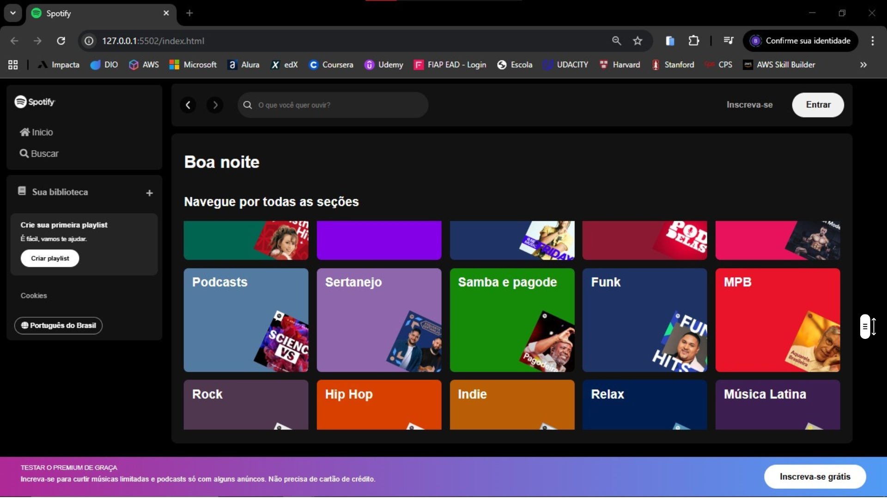
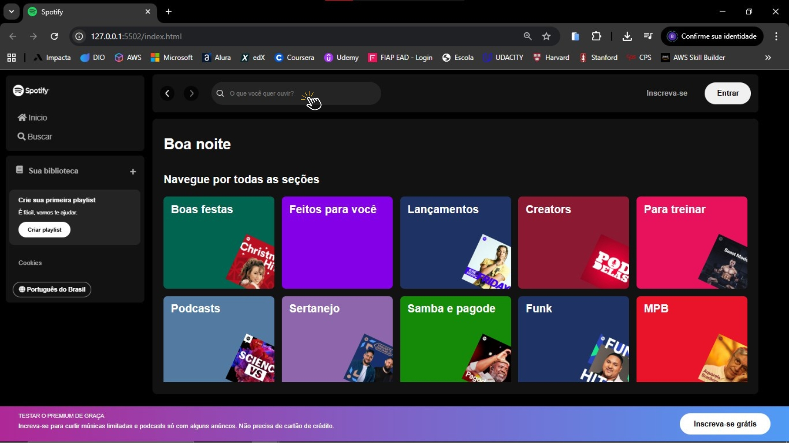
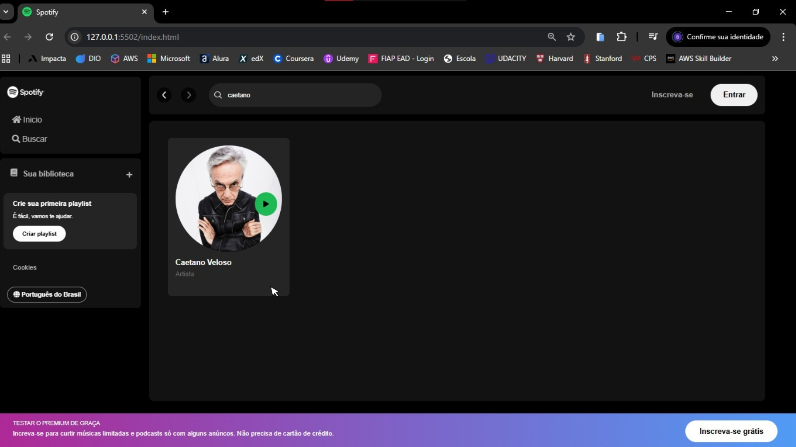
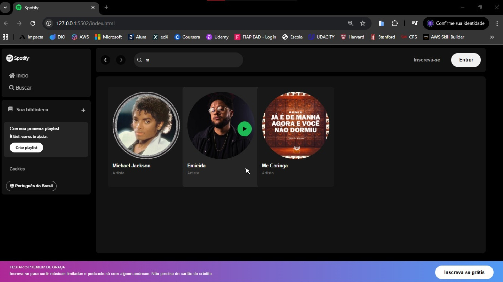

# Plataforma Spotify 🎧

Este projeto foi desenvolvido como parte da segunda edição da Imersão Front-End da Alura. O objetivo foi recriar a interface do Spotify e integrá-la a uma API, permitindo pesquisar artistas e músicas diretamente na aplicação.

---

## 📌 Índice
- [Funcionalidades](#-funcionalidades)
- [Tecnologias Utilizadas](#-tecnologias-utilizadas)
- [Como Rodar o Projeto](#-como-rodar-o-projeto)
- [Como Usar](#-como-usar)
- [Participe da Brincadeira!](#-participe-da-brincadeira)

---

## 📝 Funcionalidades

- Pesquisa de músicas e artistas integrada a uma API com resultados em tempo real.
- Exibição de playlists e álbuns em cards com rolagem horizontal.
- Saudação dinâmica na tela inicial, que muda conforme o horário do dia (bom dia, boa tarde, boa noite)
- Player de música (simulado) com reprodução.
- Interatividade com JavaScript, atualizando dinamicamente o conteúdo.
- Design responsivo, adaptável para desktop, tablet e mobile.

## 💻 Tecnologias Utilizadas

- **HTML5**: Estruturação semântica da página.
- **CSS3**: Estilização moderna e responsiva.
- **JavaScript**: Interatividade e manipulação do DOM.
- **Node.js**: Servidor para rodar a API e executar a aplicação localmente

## 💡 Como Rodar o Projeto


### Pré-requisitos

- Ter o [Visual Studio Code (VSCode)](https://code.visualstudio.com/) instalado, caso queira visualizar o código localmente.
- Ter o [ Node.js ](https://nodejs.org/pt) instalado, caso queira consumir a API.

### Passos

1. Clone o repositório no terminal:
   ```bash
   git clone https://github.com/bianca-bomfim/spotify-plataforma
   ``` 

2. Abra o arquivo index.html no Visual Studio Code e use a extensão "Live Server" para rodar o projeto em um navegador.

    [Instalando e Rodando a Extensão](https://marketplace.visualstudio.com/items?itemName=ritwickdey.LiveServer) 
   
3. Inicie o servidor da API:
    ```bash
   json-server --watch api-artists/artists.json --port 3000
   ``` 
4. Abra a aplicação no navegador

    [Acesse o localhost](http://localhost:3000/) 

## 👥 Como Usar

<br>
1. Abra a aplicação no navegador após rodar o projeto (http://localhost:3000). <br><br>


<br><br>


2. Navegue entre diferentes playlists e álbuns utilizando o scroll horizontal dos cards. <br><br>


<br><br>

3. Clique na barra de pesquisa para buscar álbuns, artistas ou músicas dentro da aplicação. <br><br>


<br><br>


4. Resultado da pesquisa exibindo o artista buscado, com informações básicas como nome e imagem.<br><br>


<br><br>


5. Não sabe o nome completo do artista? Sem problemas! A aplicação retorna resultados mesmo ao pesquisar apenas uma parte do nome.<br><br>


<br><br>


## 🎉 Experimente Você também!

Quer explorar músicas, artistas e playlists de forma prática e interativa? 
Clone o projeto, rode localmente e descubra como é fácil navegar entre diferentes seções e buscar seus artistas favoritos.
